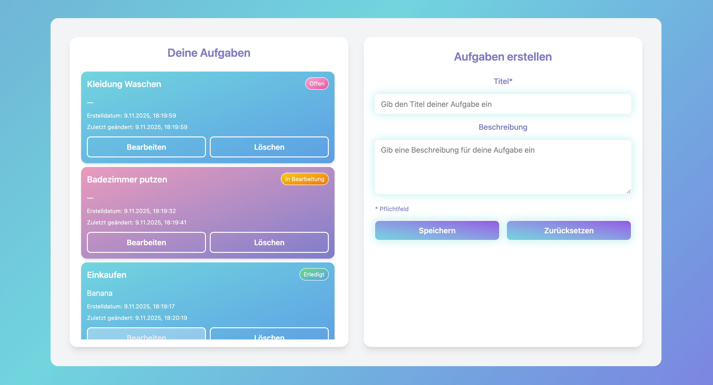
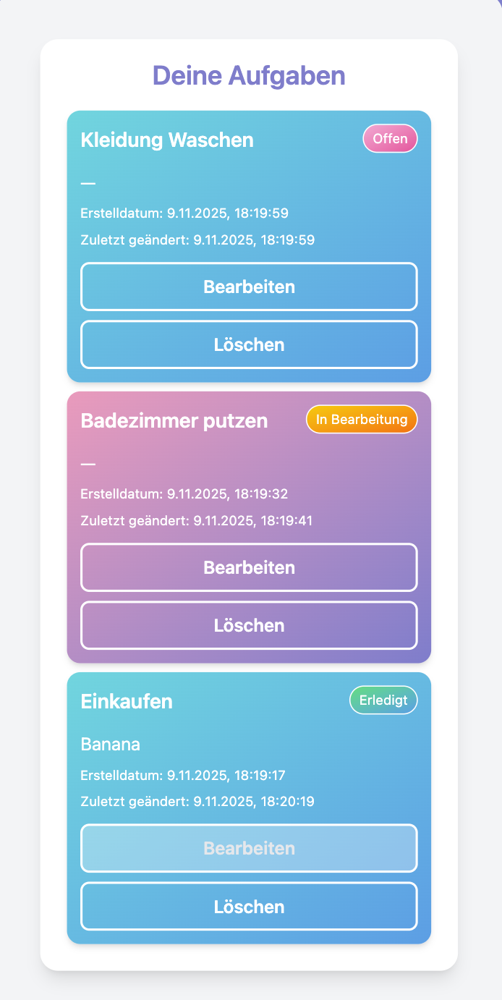
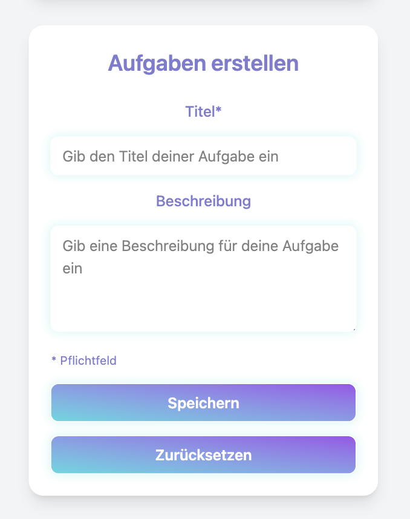

# To-Do App
Eine kleine Fullstack-Anwendung zum Verwalten von Aufgaben - entwickelt mit **React + TypeScript + Tailwind CSS** (Frontend) und **Django REST Framework** (Backend).  

## Features / Funktionen
- Erstellen, Lesen, Bearbeiten und Löschen von To-Dos (CRUD)
- Felder: Titel, Beschreibung, Status, Erstelldatum, Updatedatum
- REST API mit klaren Endpunkten (`/api/todos/`)
- Responsives UI mit Tailwind CSS

## Projektstruktur
Das Projekt ist in **Frontend** und **Backend** klar getrennt.

### Frontend (React + TypeScript + Tailwind)

#### Komponentenübersicht
- **`TodoView.tsx`**
  - Die Haupt-View-Komponente („Elternkomponente“), die den Anwendungszustand verwaltet.
  - Verantwortlich für das Laden der To-Do-Daten sowie das Weitergeben von Funktionen für Create, Update und Delete an untergeordnete Komponenten.
  - Nutzt den `TodoController` zur Steuerung der Datenflüsse und API-Operationen.
  - Rendert:
    - `<TodoForm />` zum Erstellen
    - `<TodoItem />` zum Anzeigen und Bearbeiten einzelner Aufgaben

- **`TodoForm.tsx`**
  - Reusable Formular-Komponente zum Anlegen von To-Dos.
  - Arbeitet mit Props, die Callback-Funktionen vom `TodoView` erhalten.

- **`TodoItem.tsx`**
  - Präsentationskomponente für einzelne Aufgaben.
  - Gibt Ereignisse wie „Bearbeiten“ oder „Löschen“ nach oben an die `TodoView` weiter.

#### Controller-Schicht

- **`TodoController.ts`**
  - Kapselt die Logik für CRUD-Operationen (Create, Read, Update, Delete).
  - Kommuniziert über eine Service-Schicht mit der API.
  - Nutzt ein **Interface (`TodoControllerInterface`)** zur Definition der Methoden.

#### Dependency Injection
- In der Datei `App.tsx` wird der konkrete TodoController instanziiert und über Props an die TodoView übergeben.
- So bleibt die TodoView entkoppelt von der Implementierung und kann leicht getestet oder erweitert werden (z. B. mit einem MockBackendService).

#### Services
- Unter `/services` liegt eine Service-Schicht, die direkt mit der REST-API kommuniziert.
- Der TodoController ruft diese Services auf und transformiert Daten zwischen API-Modellen und UI-Modellen.

#### Fehlerbehandlung
- **APIBackendService** erkennt HTTP-Fehler und wirft `Error`-Objekte.  
  → Diese Schicht entscheidet **nicht**, wie der Fehler dargestellt wird.
- **Controller** kann Fehler optional abfangen oder weiterreichen.
- **View-Komponenten (React)** fangen Fehler ab und zeigen Benutzerfeedback (z. B. Alerts oder Meldungen) an.

#### Architekturprinzipien
- Trennung von Zuständigkeiten (View ↔ Controller ↔ Service)
- Dependency Injection zur Entkopplung
- Wiederverwendbare, modulare Komponenten

### Backend (Django + DRF)
- **Models**: Definieren die Datenstruktur der To-Dos.
- **Serializers**: Übersetzen zwischen Django-Modellen und JSON-Daten für die REST-API.
- **Views / Controller-Schicht**:  
  - Implementiert über `TodoViewSet(viewsets.ModelViewSet)`, das alle CRUD-Operationen bereitstellt.
- **URLs**: REST-Endpunkte nach dem Schema `/api/todos/`.

## CI/CD
GitHub Actions führt die Tests automatisch bei `push` und `pull_request` aus.
- **Frontend**: 
- laufen mit Vitest + Testing Library + JSDOM.
- Netlify (Deploy aus `todo-frontend`)
- **Backend**:
- Backend-Tests laufen mit pytest + pytest-django.
- Railway (Deploy aus `todo-backend`)
**Live in** : https://todo-chun.netlify.app/

## Screenshots

  
  

## Erweiterungsmöglichkeiten
- Benutzerauthentifizierung & Login-System (mit Django Auth + JWT).
- Filter- & Suchfunktion im Frontend und Backend
- Dark Mode & Theme-System
- Erweiterte Architektur (Model Layer)
